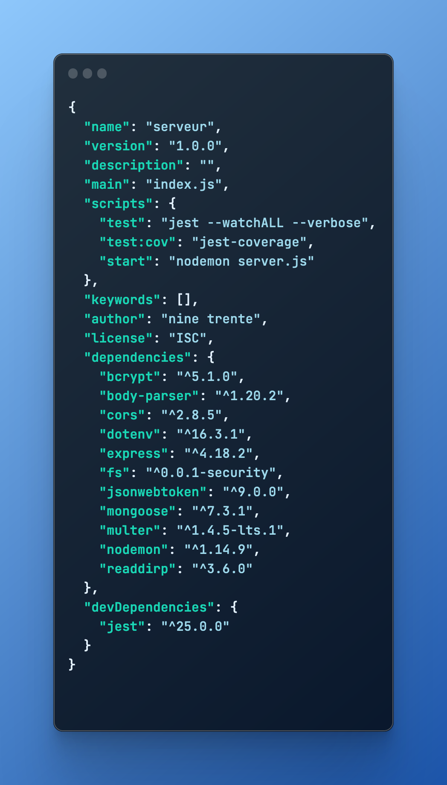
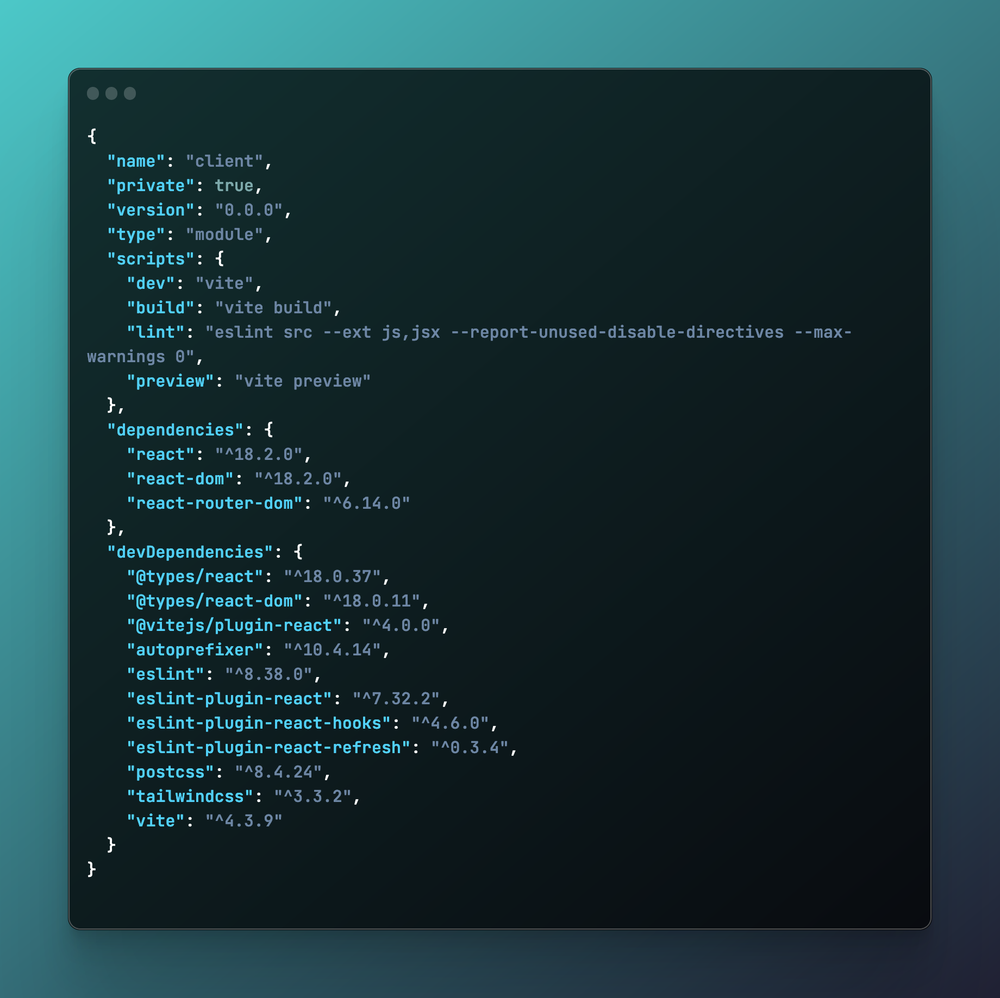

# Back End du projet collectif Nine Thirty !

# Config

# Design patterns

Models qui gère nos schémas lié à MongoDB.
Controllers qui exécute les fonctions et qui fait jonction entre la base de données et la/les routes.
Routes qui permet de gérer les chemins d'accès de notre serveur.

## Logique de fonctionnement du projet

Un fichier server.js crée et distribue les informations sur le port 3000 par défaut ou soit par un port contenu dans un fichier .env local. Il fait appel au fichier app.js qui celui la gère toute la logique de notre serveur (models, controllers, routes).

# Front End du projet collectif Nine Thirty

# 9.30_Git
